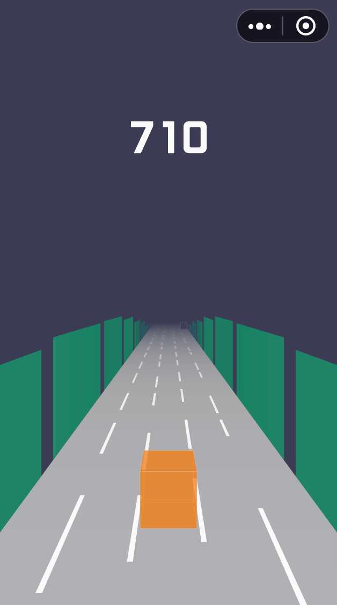

# rungame-blog
用 [THREE.js](https://github.com/mrdoob/three.js/) + [wxgame-typescript-starter](https://github.com/inarol/wxgame-typescript-starter) 写的音乐跑酷微信小游戏，持续更新中。

- [用Three.js写3D跑酷微信小游戏-前言](./section1.md)
- [用Three.js写3D跑酷微信小游戏-创建舞台和游戏主角](./section2.md)
- [用Three.js写3D跑酷微信小游戏-添加跑道和NPC](./section3.md)
- [用Three.js写3D跑酷微信小游戏-控制主角](./section4.md)
- [用Three.js写3D跑酷微信小游戏-游戏计分](./section5.md)
- [用Three.js写3D跑酷微信小游戏-背景音乐和音乐动效](./section6.md)
- [用Three.js写3D跑酷微信小游戏-游戏按钮](./section7.md)

源码地址：[https://github.com/inarol/rungame](https://github.com/inarol/rungame)

*如果对你有用，就star一下吧，O(∩_∩)O哈哈哈~*

游戏截图 👇 ：

