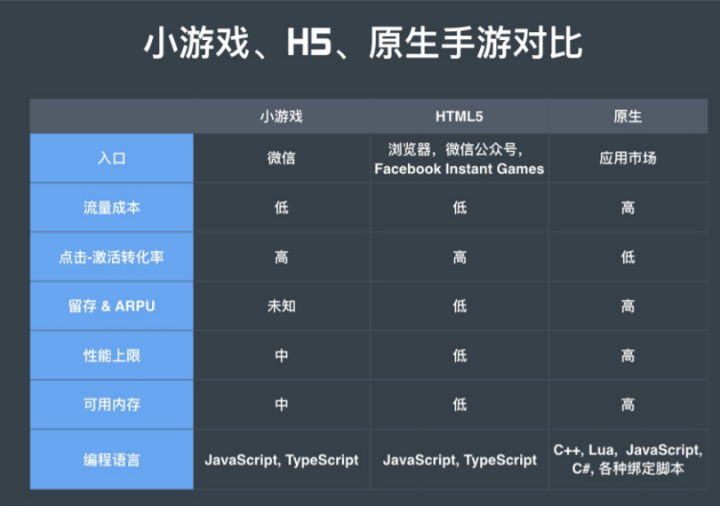
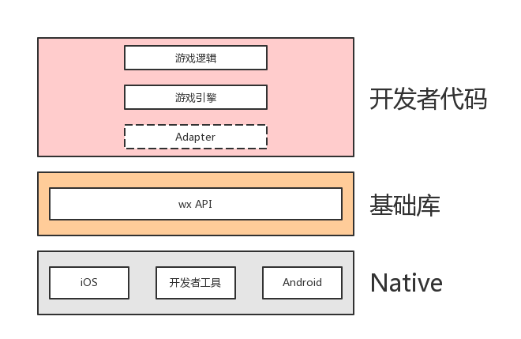

## 目录

* [前言](#前言)
* [认识微信小游戏的环境](#认识微信小游戏的环境)
* [准备工作](#准备工作)
* [关于 <a href="https://threejs.org/docs/index.html" rel="nofollow">Three.js</a>](#关于-threejs)

## 前言

2018年初，微信小游戏正式对开发者开放注册，游戏开发社区一片轰然，自从H5神经猫刷爆朋友圈后，甚至很多游戏开发商研发了各类H5页游，但都呈现出不温不火的局面。从技术的角度上分析，个人总结主要原因有以下几点：

  - 移动设备分配给`webview`的内存不多，游戏会出现卡顿现象，体验不如原生。
  - H5游戏调用设备底层的硬件能力受限，从而间接影响游戏的可玩性下降。

但是微信小游戏作了一些技术上的突破，在游戏体验上可以媲美原生应用，以下是微信小游戏、H5游戏、Native对比图（图转）。



## 认识微信小游戏的环境

1）微信小游戏的技术架构



2）**执行引擎**  
  在IOS平台下，微信小游戏的JavaScript代码运行在`JavaScriptCore`上，而Android平台下，JavaScript代码则是用`Google V8`引擎运行。 

3）**执行环境**  
  微信小游戏的执行环境注入了`wx`变量，同时移除了 BOM 和 DOM ，意味着在这个环境下，没有 window 和 document这两个对象。 但微信官方提供了一个模拟 BOM 和 DOM 的兼容库`weapp-adapter`，所以在该环境下也是可以调用`document.createElement('canvas')`时，原因就是 weapp-adapter 库已经模拟了 document 对象了，weapp-adapter 的代码如下：
  ```js
  var document = {
    ...
	  createElement: function createElement(tagName) {
	    if (tagName === 'canvas') {
	      return new _Canvas2.default();
      }
      ...
    }
    ...
  }
  ```

4）**创建canvas**  
  在微信小游戏环境下，可通过`wx.createCanvas()`创建canvas，但一个微信小游戏环境只能创建一个主屏canvas，再次调用则是创建离屏的canvas。

## 准备工作

- 下载 [微信开发者工具](https://developers.weixin.qq.com/miniprogram/dev/devtools/download.html)
- 前往 [微信公众平台](https://mp.weixin.qq.com/wxopen/waregister?action=step1) 注册小游戏，目前已经支持个人开发者注册了
- 前往 clone 基于Typescript + Webpack的微信小游戏模板 -> [wxgame-typescript-starter](https://github.com/inarol/wxgame-typescript-starter)
- 下载最新版的 [Three.js](https://github.com/mrdoob/three.js/releases).
- 前往 [小游戏后台](https://mp.weixin.qq.com/wxopen/devprofile) -> 开发 -> 开发设置 -> 获取`appId` -> 打开微信开发者工具 -> 输入`appId` -> 打开wxgame-typescript-starter -> `npm start` ->开始撸代码。

## 关于Three.js
  相比`CocosJS`、`Egret`这些重型的游戏引擎, 在我看来，虽然 Three.js 只是一个3D图形渲染库，缺失了一些游戏引擎的能力，例如`碰撞检测`, `精灵动画`等。但在我看来，越简单的东西越是灵活，没有高度封装，对于实现一些特殊的交互动画时，不会受限于框架的设计，而且此次我们需要实现的只是一个简单的 **3D跑酷游戏** 。还有从技术上来说，学习新东西，如果开始时能从基础的学起，后续再使用框架的话就能得心应手了，提前依赖框架并不是什么好事。

  由于Three.js这个库很强大，涉及的内容较多，把整个类库啃完再去撸代码有点不现实，建议边撸边查文档。文档地址：[https://threejs.org/docs/index.html](https://threejs.org/docs/index.html)