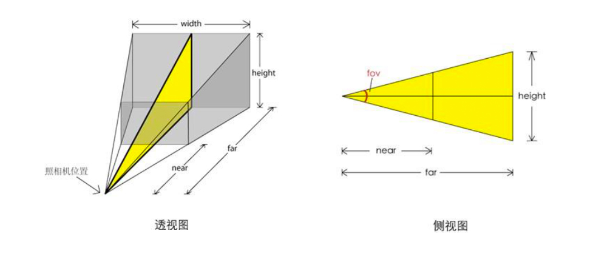
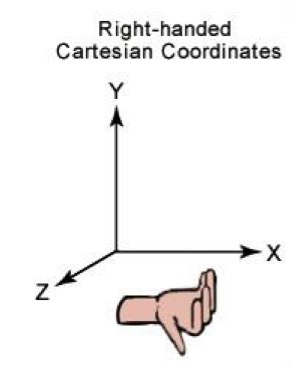
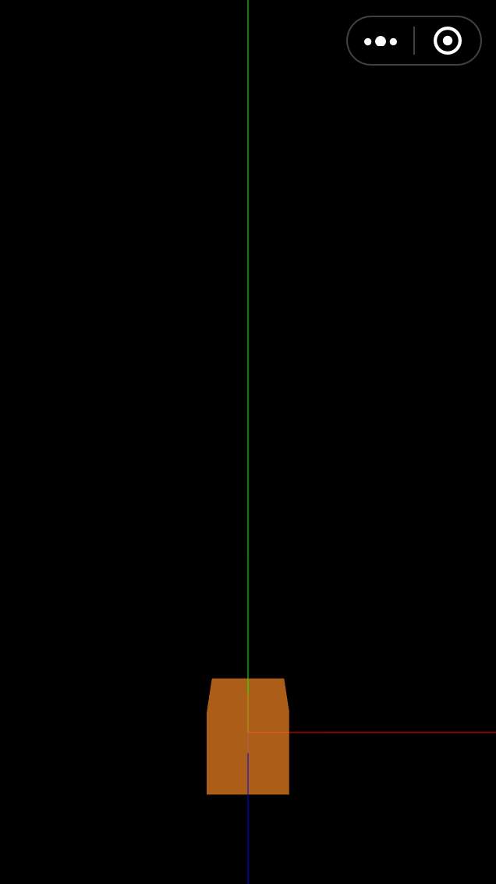

## 目录

* [游戏元素](#游戏元素)
* [创建舞台场景](#创建舞台场景)
* [创建摄影机](#创建摄影机)
* [创建渲染器](#创建渲染器)
* [创建主角](#创建主角)
* [移动camera到合适的位置（坐标）](#移动camera到合适的位置坐标)
* [总结](#总结)

## 游戏元素

**舞台**是游戏开发中的一个术语，意思是用来显示游戏元素的平台，所有的游戏元素只有添加到舞台，才能够显示到用户的界面。以这个音乐跑酷小游戏为例，我们需要实现的有哪些元素呢？归纳起来，主要元素有：

- 菜单按钮
- 主角
- NPC
- 赛道
- 计时分数
- 音乐动画帧


## 创建舞台场景

我们先不管这些游戏元素该怎么实现的，目前我们的任务是，先实现一个舞台。Three.js实现一个舞台非常简单：

```js
const scene = new THREE.Scene();
```
但这仅仅只是一个舞台场景而已，在3D世界中，我们还需要一台摄影机（相当于用户的眼睛），摄影机的摆放位置（坐标），决定了屏幕呈现元素的角度：

## 创建摄影机

创建一台摄影机：

```js
const camera = new THREE.PerspectiveCamera(75, window.innerWidth / window.innerHeight, 0.1, 4000);
```

`PerspectiveCamera`是透视摄影机类，继承于`THREE.Camera`类，用这种模式的摄影机，在3D世界中，图像会是**近大远小**的情况。该类分别接受4个参数`fov`（field of view，视野大小）， `aspect`(视窗宽高比), `near`(距离摄影机最近的位置，最小值为0.1)，`far`(距离摄影机最远的位置)。



near和far决定了成像的空间范围，far一般不宜过大，否则会造成性能渲染问题。

还有其他模式的摄影机：

- CubeCamera
- OrthographicCamera
- StereoCamera

这里不作介绍了，感兴趣可以查看：[https://threejs.org/docs/index.html#api/zh/cameras/Camera](https://threejs.org/docs/index.html#api/zh/cameras/Camera)


## 创建渲染器

有了舞台场景，摄影机了，但是还缺少一个东西：**WebGL渲染器**。创建`WebGL渲染器`：

```js
const renderer = new THREE.WebGLRenderer({
  canvas: canvas,
  alpha: true,
  antialias: true,
});
renderer.setSize(innerWidth, innerHeight);
renderer.setPixelRatio(RATIO);
```
这里设置了3个参数，作用分别是：

- `canvas`指定渲染到哪个canvas，如果没有指定，则会创建一个新的canvas。这里因为微信小游戏默认创建了主屏canvas，并暴露到全局环境中，所以设置值为`canvas`即可。  
- `alpha`是声明canvas是否需要透明度，这个游戏需要有透明度，所以为`true`。  
- `antialias`则是表示是否需要执行抗锯齿。

为了兼容Retina屏幕，我们需要设置dpr值为`devicePixelRatio`。

最后调用`render`方法，把舞台和摄影机都加入渲染器:

```js
renderer.render(scene, camera);
```

## 创建主角

舞台，摄影机，WebGL渲染器都具备了，但是如果没有主角的话，我们看到的将是漆黑一片，所以我们还需要创建一个主角，在这个小游戏中，我们的主角非常简单，就是一个3D几何体：

```js
const boxGeometry = new THREE.BoxGeometry(8, 8, 8);
```
`BoxGeometry`是立方几何体模型，分别接受宽(width)、高(height)，深(depth)3个参数。

同时还需要创建材质：`boxMaterial`，相当于模型的皮：

```js
const boxMaterial = new THREE.MeshBasicMaterial({
  color: 0xe67e22,
  transparent: true,
  opacity: 0.75,
});
```

最后创建立方几何体网格：Mesh，并确定位置：

```js
const box = new THREE.Mesh(boxGeometry, boxMaterial);
```

然后把 `box` 元素添加到舞台`scene`：

```js
scene.add(box);
```

主角虽然创建了，但是我们并没有设置`camera`的位置，因此摄影机和主角都处在3D坐标系的原点`(0, 0, 0)`，所以还需要我们完成最后一步，把`camera`移动到合适的位置。

## 移动camera到合适的位置（坐标）

移动camera之前，我们需要认识什么是3D坐标系（图转），3D坐标系遵循右手坐标系：



3D世界的中心坐标为`(0, 0, 0)`，即`x`，`y`，`z`值分别都为`0`。

移动camera的位置：

```js
// 移动到x坐标为0，y坐标为30，z坐标为60的位置
camera.position.set(0, 30, 60);
```

这时候，我们就可以看到舞台上有个橘黄色的立方体：



可能你已经注意到了，舞台上出现了红、绿、蓝的线条，没错，他们分别代表`x`，`y`，`z`轴，这些线条就是辅助坐标系，对于调试元素的位置坐标非常有用，它是Three.js提供的`AxesHelper`。创建辅助坐标系:

```js
// 10000代表辅助线的长度
const axesHelper = new THREE.AxesHelper(10000);
```

## 总结

最后我们需要把一些数值参数提取到`constant.ts`常量文件，后续方便我们调整游戏的参数，调整之后的代码结构是：

```bash
./src
├── Game
│   ├── Player // 游戏主角
│   │   └── index.ts
│   ├── camera // 摄影机
│   │   └── index.ts
│   ├── constant.ts // 常量
│   ├── helper
│   │   └── axes.ts // 辅助坐标系
│   ├── index.ts
│   ├── renderer // WebGL渲染器
│   │   └── index.ts
│   └── scene // 舞台场景
│       └── index.ts
├── index.ts // 入口
└── lib
    └── weapp-adapter.js // 模拟BOM，DOM
```

代码：：https://github.com/inarol/rungame/tree/section1