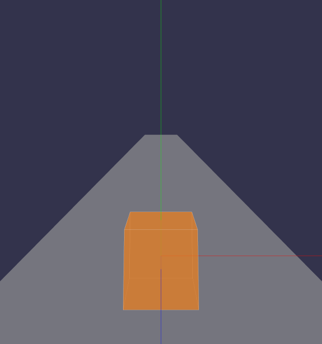
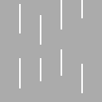
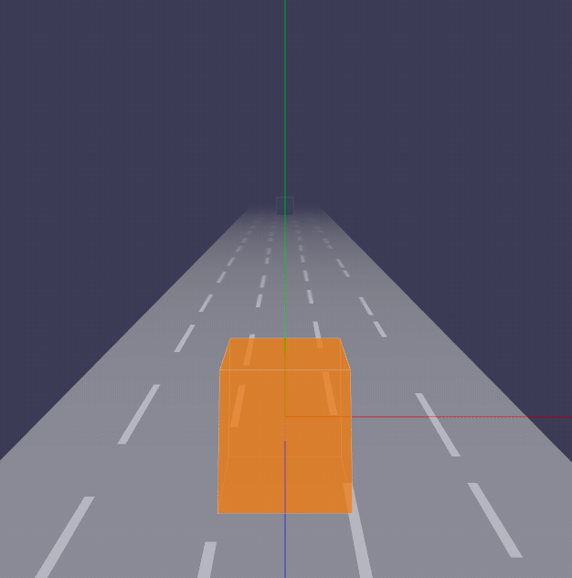

## 目录

* [创建跑道](#创建跑道)
* [添加雾化效果](#添加雾化效果)
* [添加跑道纹理效果](#添加跑道纹理效果)
* [添加NPC](#添加npc)
    * [创建NPC](#创建npc)
    * [移动动画](#移动动画)
    * [使用对象池创建多个NPC](#使用对象池创建多个npc)
    * [碰撞检测](#碰撞检测)
* [优化效果](#优化效果)
* [总结](#总结)

上一节中，我们已经创建3D世界和游戏主角。在本节中我们需要创建跑道和NPC（障碍物），以及碰撞检测。

## 创建跑道

首先，我们设定跑道是一个没有厚度属性的平面模型，而Three.js已经内置提供了这样一种平面模型: `PlaneGeometry`类。

该类接受4个参数：`width`，`height`，`widthSegments`，`heightSegments`，分别表示宽度，高度，宽度分段数，以及高度分段数。宽度/高度分段数决定了该平面由小三角形组成的个数，默认值为`1`，分段数越多，平面的细节越细腻。

创建跑道模型、材质和网格： 

```js
// constant.ts
/** 跑道参数 */
const RACETRACK_SEGMENTS = 5;
export const SEGMENT_WIDTH = (PLAYER.width + 2);
export const RACETRACK = {
  /** 跑道宽度 */
  width: SEGMENT_WIDTH * RACETRACK_SEGMENTS,
  /** 跑道高度 */
  height: CAMERA.far,
  /** 跑道y坐标 */
  y: - PLAYER.height / 2,
  /** 跑道分段 */
  segments: RACETRACK_SEGMENTS,
  /** 单条跑道宽度 */
  segmentWidth: SEGMENT_WIDTH,
};
```

```js
// Racetrack/index.ts
const geometry = new THREE.PlaneGeometry(RACETRACK.width, RACETRACK.height);
const material = new THREE.MeshBasicMaterial({
  color: 0x999999,
  transparent: true,
  opacity: 0.4,
});
const plane = new THREE.Mesh(racetrackGeometry, racetrackMaterial);
```

此时，跑道是平行于屏幕的，我们需要把它绕x轴旋转`90°`，使它垂直于屏幕。而且旋转后，跑道的长度有接近一半的大小是我们看不到的，出于优化性能，我可以尽可能地减少跑道的长度，所以旋转后，可以把跑道沿`z`轴位移`- RACETRACK.height / 2`，但需要补偿摄影机的位置，另外跑道的`y`轴需要位移`- PLAYER.height / 2`，使游戏主角刚好落在跑道平面上：
```js
// Racetrack/index.ts
plane.rotateX(THREE.Math.degToRad(-90));
plane.position.set(0, RACETRACK.y, - RACETRACK.height / 2 + CAMERA.z);
```

最后把跑道`plane`添加到舞台`scene`中，我们就可以看到这样的效果了：



## 添加雾化效果

目前的游戏效果看来，如果给舞台添加雾化效果的话，不仅方便我们处理跑道的边界问题，而且给游戏添加一点神秘的效果。添加雾化效果是使用THRRE.Scene的`fog`属性：

```js
// constant.ts
/** 3D边界值（坐标值） */
const BOUNDARY = {
  /** z轴起始点 */
  zStart: CAMERA.z,
  /** z轴结束点，摄影机可视最远处（需要补偿摄影机的位移`CAMERA.z`） */
  zEnd: - CAMERA.far + CAMERA.z,
};
/** 雾化效果的可见区域 */
const VISIBLE_AREA = {
  /** 起始点 */
  start: -PLAYER.depth / 2,
  /** 结束点 */
  end: Math.abs(BOUNDARY.zEnd),
};
```

```js
// scene/index.ts
scene.fog = new THREE.Fog(this.backgroundColor, VISIBLE_AREA.start, VISIBLE_AREA.end);
```

`Fog`接收3个参数，分别代表雾的颜色，雾化起始点（正值），雾化结束点（正值），从起始点到结束点，雾的密度会越来越大。

给舞台添加雾化效果后是这样的：


## 添加跑道纹理效果

目前跑道是纯色的，显得有点单调，下面我们就给跑道添加纹理图片：



在Threejs中，纹理贴图是在材质中指定的：

```js
// Racetrack/index.ts
const getTexture = (): THREE.Texture {
  const image: any = wx.createImage();
  const texture = new THREE.Texture(image);
  image.onload = () => {
    texture.needsUpdate = true;
  };
  image.src = 'assets/img/racetrack-texture.png';
  return texture;
}
const racetrackMaterial = new THREE.MeshBasicMaterial({
  map: texture,
});
```

上面的代码中，`getTexture`方法是通过wx.createImage加载图片源，再通过THREE.Texture(image)生成纹理贴图，值得注意的是，在图片加载完成后，需要修改纹理贴图的`needsUpdate`，表示需要更新纹理贴图，否则贴图将不能正常显示。


## 添加NPC

`NPC`（Non-Player Character）是游戏的一个术语，意思是非玩家角色。

在这个跑酷游戏中，我们给NPC定义为游戏的障碍物，在游戏中具备以下特征：

- 定时且无限创建
- 具备移动能力
- 与玩家角色会发生碰撞


### 创建NPC

首先我们需要创建一个NPC，而在游戏过程中，定时地实例化这个类，新建NPC类：

```js
// NPC/index.ts
export interface INPC {
  /** 3D模型 */
  mesh: THREE.Mesh;
}

export default class NPC implements INPC{
  public mesh: THREE.Mesh;
  /** 渲染 */
  public render() {
    const boxGeometry = new THREE.BoxGeometry(NPC_CONFIG.width, NPC_CONFIG.height, NPC_CONFIG.depth);
    const boxMaterial = new THREE.MeshBasicMaterial({
      color: 0x34495e,
      transparent: true,
      opacity: 0.75,
    });
    const box = new THREE.Mesh(boxGeometry, boxMaterial);
    const position = this.generatePosition();
    box.position.set(
      position.x,
      position.y,
      position.z,
    );
    return box;
  }
  constructor() {
    this.mesh = this.render();
  }
  /** 生成npc位置信息 */
  private generatePosition() {
    const size = this.size;
    return {
      // 随机x轴位置
      x: RACETRACK.width / RACETRACK.SEGMENTS * util.rnd(-2, 2, true),
      // npc的y坐标需要以主角的位置进行调整
      y: size.height / 2 - PLAYER.height / 2,
      // 起始点边界外
      z: BOUNDARY.zEnd - size.depth / 2,
    };
  }
}
```

然后实例化NPC并且添加到舞台中：

```js
// Game/index.ts
const npc = new NPC();
scene.add(npc.mesh);
```

由于我们创建npc时，把它移到了相机的可视范围的最远处，所以舞台上并不能看到它，因此我们还需要实现另外一个动画功能：`移动`。

### 移动动画

我们知道，在跑酷游戏中，障碍物一般情况下，都是从跑道的最远处沿着**z轴**慢慢地靠近摄影机，所以实现该动画并不能，改变障碍物元素的`position.z`即可。  
我们知道动画的基本原理是：许多静止的画面，在一定的播放频率逐帧播放，就是我们常说的FPS，一般来讲，FPS达到60帧/秒，对用户肉眼的感知来说，画面已经非常流畅了。微信小游戏提供了一个跟浏览器一样的渲染动画API：`requestAnimationFrame`，我们可以利用它做动画渲染：

```js
// Game/index.ts
/** ticker */
ticker() {
  // 逐帧移动npc
  npc.move();
  window.requestAnimationFrame(this.ticker.bind(this));
}
```

实现npc的`move`方法：

```js
// NPC/index.ts
/** 移动 */
public move() {
  this.mesh.position.z += 1;
}
```


此时我们能看到NPC已经能动起来了。


不过看起来移动速度太慢啊，不够刺激啊，所以还需要调整一下移动的速度：`speed`，这个数值是如何确定的呢？首先我们初始化`speed`为`0.3`，`fps`为`60`，假设我们设定npc的移动速度为，1秒内从摄影机最远处移动到摄影机后面，那么移动的计算公式就出来了：

> moveDistance = speed * Math.abs(CAMERA.far) / fps;

因此我们需要修改一下代码：

```js
// Game/index.ts
update() {
  // 逐帧移动npc
  npc.move(1, 60);
}

// NPC/index.ts
public move(speed, fps) {
  const moveDistance = speed * Math.abs(CAMERA.far) / fps;
  this.mesh.position.z += moveDistance;
}
```

经过调整后，npc移动的速度已经调整为花0.3秒（被speed值影响，原本是1秒）的时间从屏幕出现到结束：



### 使用对象池创建多个NPC

把这个内容要放在移动动画之后，是因为我们添加多个NPC时跟动画有一定的关联性。接下来我们设定每个NPC位移1/3的距离后，即添加下一个NPC，所以我们需要新增一个方法去创建NPC：

```js
// Game/index.ts
private npcs: INPC[] = [];
private frame: number = 0;
ticker() {
  this.frame += 1;
  this.moveNPC();
  ...
}
/** 添加NPC **/
addNPC() {
  const npc = new NPC();
  this.scene.add(npc.mesh);
  this.npcs.push(npc);
}
/** 移动NPC */
moveNPC() {
  if (this.npcs.length) {
    this.npcs.forEach((npc) => {
      npc.move({
        game: this,
        add: () => {
          // 添加NPC
          this.addNPC();
        },
      });
    });
  }
}

// NPC/index.ts
/** 移动 */
public move(params: {
  /** 游戏类 */
  game: IGame;
  /** 添加NPC回调 */
  add: () => void;
}) {
  // 伪代码，表示位移了三分一直距离
  if (this.mesh.position.z > thirdDistance ) {
	add();
  }
}
```

从上面的代码可以看出，只要游戏进行中，每一个NPC只要位移了1/3距离，那么就会实例化一次NPC类，我们知道频繁实例化对象会消耗CPU的计算。在游戏开发模式中，有个设计模式经常被使用到的，它就是`对象池`，也就是实例化后的npc应该被存储到对象池中，需要的时候，我们不需要重新实例化，只要调整一下对象的属性，就可以重新使用了，从而提升代码性能。接下来我们要实现对象池，即新建一个`Pool`类（来自微信小游戏打飞机模板的`Pool`类，这里只是翻译成Typescript版本）：

```js
// Pool/index.ts
const __ = {
  poolDic: Symbol('poolDic'),
};

export interface IPool {
  /** 从对象池中获取对象 */
  getItemByClass: <T>(name: string, className: new () => T) => T;
  /** 将对象回收到对象池 */
  recover: (name: string, instance: object) => void;
}

/**
 * 简易的对象池实现
 * 用于对象的存贮和重复使用
 * 可以有效减少对象创建开销和避免频繁的垃圾回收
 * 提高游戏性能
 */
export default class Pool implements IPool{
  constructor() {
    this[__.poolDic] = {};
  }
  /**
   * 根据对象标识符
   * 获取对应的对象池
   */
  getPoolBySign(name) {
    return this[__.poolDic][name] || (this[__.poolDic][name] = []);
  }
  /**
   * 根据传入的对象标识符，查询对象池
   * 对象池为空创建新的类，否则从对象池中取
   */
  getItemByClass(name, className) {
    const pool = this.getPoolBySign(name);
    return pool.length ? pool.shift() : new className();
  }
  /**
   * 将对象回收到对象池
   * 方便后续继续使用
   */
  recover(name, instance) {
    this.getPoolBySign(name).push(instance);
  }
}
```
此时我们实例化NPC类的方式需要通过Pool的`getItemByClass`函数来实现：

```js
// Game/index.ts
const npc = this.pool.getItemByClass('npc', NPC);
```

那么我何时回收NPC对象到对象池呢？没错，就是在NPC运动到屏幕之外时。因此，我们需要在`move`方法新增一个越界回调`out`方法：

```js
// Game/index.ts
npc.move({
  game: this,
  add: () => {
    // 添加NPC
    this.addNPC();
  },
  out: () => {
    // 回收npc实例化对象，并重置对象属性。
    npc.reset();
    this.pool.recover('npc', npc);
    // 移除越界的NPC
    this.npcs.splice(index, 1);
  },
});
```

最后我们可以看到，虽然npc元素在游戏中出现了很多次，但只实例化了1次，也就是只调用了一次`render`，这极大的优化游戏的性能:


### 碰撞检测

这是我们本小节需要实现的最后一个功能：`碰撞检测`，即运动的npc会与玩家角色发生碰撞。因为该游戏对碰撞的精度要求比较低，因此我们采用`AABB包围盒`的算法进行碰撞检测。计算公式：

> (A.minX <= B.maxX && A.maxX >= B.minX) &&  
> (A.minY <= B.maxY && A.maxY >= B.minY) &&  
> (A.minZ <= B.maxZ && A.maxZ >= B.minZ);

上面的公式表示A与B发生了碰撞了。

在THREE.js中，内置了方法去包裹一个3D立方体：

```js
// NPC/index.ts
const npcMeshAABB = new THREE.Box3().setFromObject(npcMesh);
const playerMeshAABB = new THREE.Box3().setFromObject(playerMesh);
```

因此判断碰撞的代码是这样的：

```js
// NPC/index.ts
function testAABB() {
  return (A.min.x <= B.max.x && A.max.x >= B.min.x) &&
    (A.min.y <= B.max.y && A.max.y >= B.min.y) &&
    (A.min.z <= B.max.z && A.max.z >= B.min.z);
}
const crashedTest = testAABB(npcAABB, playerAABB); // 发生碰撞
```


但是AABB包围黑测试法普遍存在的一个问题：高速运动的物体，在2帧之间两个物体已经发生了碰撞并穿透过去，这时候是无法捕捉到碰撞事件的。


因此我们还需要处理一下高速运动情况，假设`speed`大于2时算是高速运动，满足下面的公式即算下一帧发生碰撞：

> npc的z坐标的最大边 + 移动距离moveDistance >= player的z坐标的最小边

```js
// NPC/index.ts
let crashedAtNextTicker = false;
if (
  game.speed > 2 && 
  npcMeshAABB.max.z + moveDistance >= playerMeshAABB.min.z
) {
  crashedAtNextTicker = true;
}
```

另外，3D的碰撞检测有很多实现方式，比如Threejs的`Raycaster`射线碰撞检测，虽然精度很高，但出于性能考虑，在这个游戏中不采用这种方案，感兴趣的可以查看：[https://segmentfault.com/a/1190000009858873](https://segmentfault.com/a/1190000009858873)。除算法外，优化碰撞检测的性能也可根据实际情况进行调优，比如在这个游戏中，npc和主角不在同个跑道时，是没必要进行碰撞检测的。

## 优化效果

目前来说，整体的效果还是比较单调的，我们再给游戏元素稍加一些修饰：

- 新增主角/NPC元素的边框效果
- 新增NPC种类
- 新增跑道纹理动画(使用texture.offset.y)

具体实现这里不再做累述了，我们可以看到优化之后的效果就好很多了：


## 总结

在本小节中，我们已经顺利完成跑道的创建和雾化、纹理效果，还有NPC的创建、移动动画，碰撞检测等。代码篇幅比较大，新增了许多代码模块，详细的项目结构如下：

```bash
./src
├── Game
│   ├── NPC // NPC角色
│   │   ├── box.ts // 正方形
│   │   ├── cone.ts // 锥形
│   │   └── index.ts
│   ├── Player // 游戏主角
│   │   └── index.ts
│   ├── Pool // 对象池
│   │   └── index.ts
│   ├── Racetrack // 跑道
│   │   └── index.ts
│   ├── camera // 摄影机
│   │   └── index.ts
│   ├── constant.ts // 常量
│   ├── helper
│   │   ├── axes.ts  // 辅助坐标系
│   │   └── orbitControls.ts // 摄影机轨道控制器
│   ├── index.ts 
│   ├── renderer  // WebGL渲染器
│   │   └── index.ts
│   ├── scene // 场景
│   │   └── index.ts
│   └── util // 工具
│       └── index.ts
├── index.ts  // 入口
└── lib
    ├── weapp-adapter-extend // weapp-adapter的扩展，新增window的方法
    │   ├── index.js
    │   └── window.js
    └── weapp-adapter.js // 模拟BOM，DOM
```

代码：：https://github.com/inarol/rungame/tree/section2