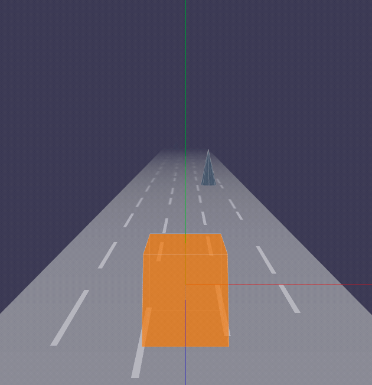
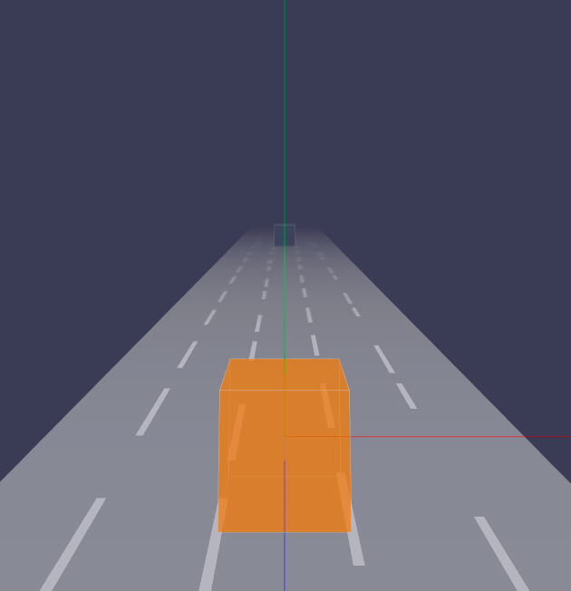
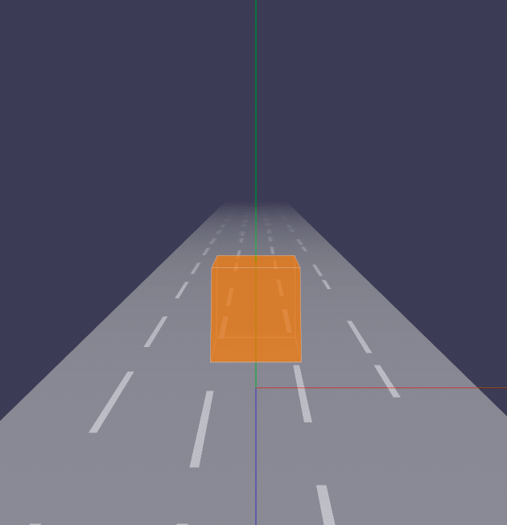

## 目录

* [动画](#动画)
  * [跳跃](#跳跃)
  * [位移移动](#位移移动)
* [控制](#控制)
* [总结](#总结)

上一小节，我们成功添加了NPC和跑道效果，但目前为止，主角还是静止的，NPC一过来，主角就只有GG了，游戏当然不能这么玩😂。因此本小节我们实现的目标：控制主角躲避NPC，而动画方式有：

- 跳跃
- 位移移动

上面的动画涉及到元素的位移、旋转等，我们逐帧计算不太现实，我们需要借助一个第三方的类库[`Tween.js`](https://github.com/tweenjs/tween.js/)，这个库主要是帮助我们快速处理补间动画。

## 动画

### 跳跃

我们需要分解一下跳跃动画，主要分成了3个动画：

- 向上跳起
- 重力下落
- 翻跟斗（翻转）

Tweenjs提供了补间动画分组功能，主要方便我们在动画完成后，可以快速清除动画的计算。首先我们创建一个动画分组:

```js
const jumpTween = new TWEEN.Group();
```

然后确定跳跃的高度：主角高度 x 2，跳跃时间为500ms：

```js
const jumpHeight = this.size.height * 3;
const durations = 500;
```

确定了数值后，就可以写补间动画了：

```js
new TWEEN.Tween(meshPosition, jumpTween)
  .to({ y: jumpHeight }, durations / 2)
  .easing(TWEEN.Easing.Quadratic.Out)
  .start();
```

接下来我们要实现第二个动画：物体重力下落动画，Tweenjs提供了链式调用的方法`chain`，该方法接受一个回调函数，并且会在`向上跳起`动画完成后执行：

```js
new TWEEN.Tween(meshPosition, jumpTween)
  .to({ y: 0 }, durations / 2)
  .easing(TWEEN.Easing.Quadratic.In)
  .onComplete(() => {
    // 动画完成后，清除动画
    jumpTween.removeAll();
  }),
```

依葫芦画瓢，用到补间动画修改threejs网格的`rotation`去实现翻转：

```js
// 翻转动画
new TWEEN.Tween(meshRotation, jumpTween)
  .to({ x: - Math.PI * 2 }, durations)
  .easing(TWEEN.Easing.Quadratic.Out)
  .start();
```

大体的跳跃动画就实现了：



### 位移移动

在这个游戏中，我们的位移动画分为两个方向：`向左`与`向右`，我们新建一个方法: `move`，同时接收一个参数`direction`，`LEFT`表示向左，`RIGHT`表示向右，移动距离大小为单条赛道的的宽度。因此实现起来比跳跃更加简单：

```js
/** 移动动画 */
public move(params: {
  direction: IDirection;
}) {
  const { direction } = params;
  const meshPosition = this.mesh.position;
  const moveTween = this.moveTween;
  const durations = 200;
  let moveDistance = 0;
  // 向左
  if (direction === 'LEFT') {
    moveDistance = - RACETRACK.segmentWidth;
  }
  // 向右
  else if (direction === 'RIGHT') {
    moveDistance = RACETRACK.segmentWidth;

  }
  new TWEEN.Tween(meshPosition, moveTween)
  .to({ x: meshPosition.x + moveDistance }, durations)
  .easing(TWEEN.Easing.Back.Out)
  .onComplete(() => {
    moveTween.removeAll();
  })
  .start();
}
```

效果如下：



## 控制

目前为止，主角的动画都是代码自执行的，因此我们还需实现一个功能：控制器，主要的操作是**点击**和**滑屏操作**。

微信小游戏的环境没有内置滑动的API，需要我们用`onTouchStart`，`onTouchEnd`去模拟。原理是，我们在`onTouchStart`时记录点击坐标，再用`onTouchEnd`的`x`, `y`坐标减去onTouchStart的`x`, `y`坐标，如果`x`坐标差值小于10，表示点击操作，否则 ，我们再用坐标差算出滑屏的角度，公式是：

> angle = Math.atan2(angY, angX) * 180 / Math.PI;

当 `angle >= -45 && angle <= 45`时，表示向右滑屏；  
当 `angle >= 135 && angle <= 180` 或 `angle >= -180 && angle < -135`时表示向左滑屏。

否则表示向上或向下滑屏，我们暂时不处理。

知道了大概的实现原理后，就可以撸码了：

```js
/** 获取点击行为 */
const getTouchResult = (startPoint: IPoint, endPoint):
{
  type: 'SLIDE' | 'TAP' | 'UNKNOW',
  value: IDirection | IPoint | '',
} => {
  const { x: startX, y: startY } = startPoint;
  const { x: endX, y: endY } = endPoint;
  const angX = endX - startX;
  const angY = endY - startY;
  // x坐标差值
  if (Math.abs(angX) >= 10) {
    const angle = Math.atan2(angY, angX) * 180 / Math.PI;
    if ((angle >= 135 && angle <= 180) || (angle >= -180 && angle < -135)) {
      return {
        type: 'SLIDE',
        value: 'LEFT',
      };
    }
    if (angle >= -45 && angle <= 45) {
      return {
        type: 'SLIDE',
        value: 'RIGHT',
      };
    }
    // 向上或向下，我们暂不需要用到
    return {
      type: 'UNKNOW',
      value: '',
    };
  }
  // 点击操作
  return {
    type: 'TAP',
    value: endPoint,
  };
}

let startPoint: IPoint = { x: 0, y: 0 };
const touchStart = ({ touches }) => {
  startPoint = {
    x: touches[0].clientX,
    y: touches[0].clientY,
  };
};

const touchEnd = ({ changedTouches }) => {
  const { type, value } = getTouchResult(startPoint, {
    x: changedTouches[0].clientX,
    y: changedTouches[0].clientY,
  });
  if (type === 'SLIDE') {
    // 滑屏操作
  }
  if (type === 'TAP') {
    // 点击操作
  }
};
wx.onTouchStart(touchStart);
wx.onTouchEnd(touchEnd);
```

上面的代码其实不只用于控制主角，后续我们还需要用于点击菜单按钮等，所以这里需要考虑把这部分代码抽离成通用模块`Gamepad`（游戏手柄），再用发布订阅的方式（用到了facebook的[emitter](https://github.com/facebook/emitter)），游戏或按钮元素去订阅这些事件，从而实现控制元素的功能。下面是实现控制主角后的效果，可以看出我已经可以控制主角，轻松自如地闪躲NPC了😁：



## 总结

当然还有一些细节需要考虑，比如每次左右移动需要判断是否到了边界，在跳跃过程中，不允许二次跳跃等问题，另外添加了主角的跳动效果。详细的项目结构如下：

```bash
./src
├── Game
│   ├── Gamepad // 游戏手柄
│   │   └── index.ts
│   ├── NPC // NPC角色
│   │   ├── box.ts // 正方形
│   │   ├── cone.ts // 锥形
│   │   └── index.ts
│   ├── Player // 游戏主角
│   │   └── index.ts
│   ├── Pool // 对象池
│   │   └── index.ts
│   ├── Racetrack // 跑道
│   │   └── index.ts
│   ├── camera // 摄影机
│   │   └── index.ts
│   ├── constant.ts // 常量
│   ├── helper
│   │   ├── axes.ts  // 辅助坐标系
│   │   └── orbitControls.ts // 摄影机轨道控制器
│   ├── index.ts 
│   ├── renderer  // WebGL渲染器
│   │   └── index.ts
│   ├── scene // 场景
│   │   └── index.ts
│   └── util // 工具
│       └── index.ts
├── index.ts  // 入口
└── lib
    ├── weapp-adapter-extend // weapp-adapter的扩展，新增window的方法
    │   ├── index.js
    │   └── window.js
    └── weapp-adapter.js // 模拟BOM，DOM
```

代码：：https://github.com/inarol/rungame/tree/section3