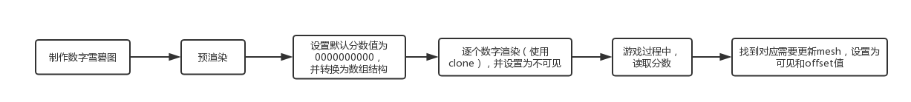
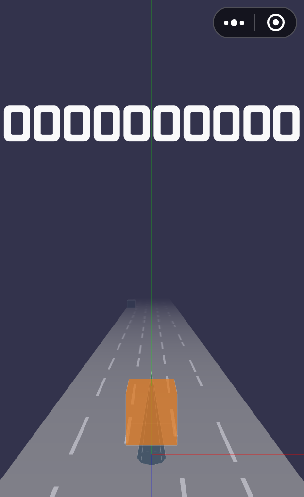
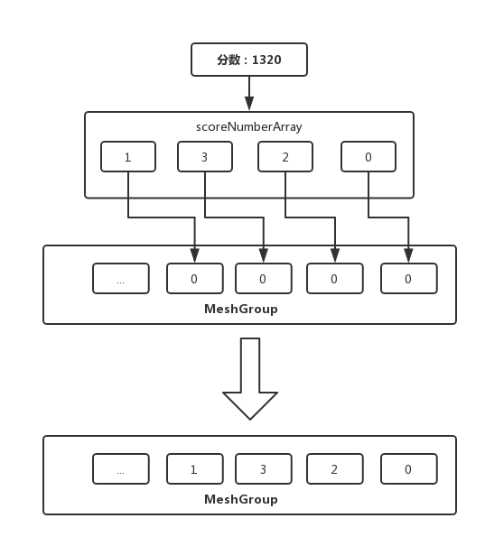
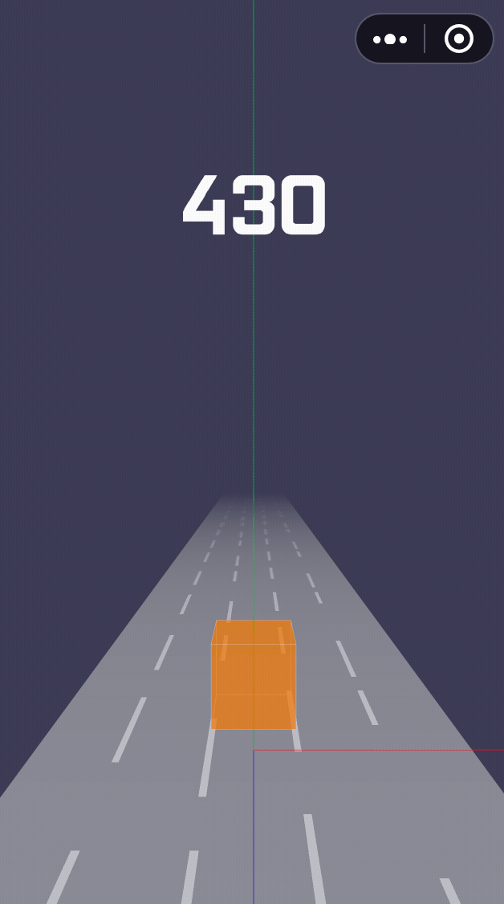

## 目录

* [预渲染](#预渲染)
* [更新分数](#更新分数)
* [添加顶层Scene](#添加顶层Scene)
* [总结](#总结)

上一节中，我们的基本已经完成了游戏过程的交互控制，本节需要实现的计分逻辑：

- 每一帧渲染，分数`+10`；
- 分数每增加2000，速度`+0.02`；
- 游戏结束，停止计分。

逻辑本身并不难，但是渲染方面需要考虑几个问题：


- Threejs需要额外加载字体文件去渲染文本；
- 分数元素可能被其他元素遮挡的问题；
- 分数刷新频率高，需要考虑渲染性能问题。

为了尽量压缩小游戏的体积包，我们基本不会考虑字体文件，需要换种方式实现，即使用纹理贴图，然后借鉴跑道的纹理贴图更新的方式，只修改贴图的偏移量实现分数的刷新，大概的实现流程如下：



### 预渲染

首先我们需要准备一张带有0到9的数字精灵图，并且是数值排列的：


首先新增一个`Score`类，并创建render方法，我们的目的是用数字精灵图是实现数字的渲染，首选，我们需要创建一个平面模型，然后贴图使用加载好的精灵贴图，注意需要设置`repeat`值为(1, 0.1)来裁剪精灵图，关键代码如下：

```js
// 创建贴图
const texture = new THREE.Texture(img);
texture.needsUpdate = true;
texture.repeat.set(1, 0.1);
texture.offset.y = 0.9;
texture.minFilter = THREE.NearestFilter;

// 创建平面模型
const geometry = new THREE.PlaneGeometry(numberWidth, numberHeight);
const material = new THREE.MeshBasicMaterial({
  map: texture,
  transparent: true, // 去png的黑底
});
const mesh = new THREE.Mesh(geometry, material);

// 遍历分数：[0,0,0,0...]
const group = new THREE.Group();
scoreNumberArray.forEach((item, i) => {
  const newMaterial = material.clone();
  const newMesh = mesh.clone();
  newMaterial.map = texture.clone();
  newMaterial.map.needsUpdate = true;
  newMesh.material = newMaterial;
  newMesh.visible = false;
  newMesh.position.set(
    numberWidth * i - totalWidthHalf + numberWidth / 2,
    SCORE.y,
    0,
  );
  group.add(newMesh);
});
```

我们可以看到，默认的分数`000000000`预渲染已经成功添加到舞台了：



### 添加顶层Scene

用Threejs.js创建的元素，添加到scene中，默认是按照添加的顺序决定元素显示的层级的，关于如何解决显示的优先级问题，有两种方案：

- 有一种方式是设置renderer渲染器的`sortObjects: false`（默认为true），然后再去设置具体元素的`renderOrder`，值越大显示的层级越高，类似于CSS的`z-index`。
- 添加顶层Scene，用于放置分数、菜单等需要在顶层显示的元素。

这个游戏采用了第二种方案，毕竟维护游戏元素一多，维护renderOrder是很头疼的一件事情。首先我们新建一个舞台`topScene`：

```js
export const topScene = new THREE.Scene();
```

需要注意的是，renderer渲染器渲染两个舞台时，第二个舞台会清除掉第一个舞台，所以我们要设置渲染器的`autoClear`为`false`：

```js
renderer.autoClear = false;
```

另外设置元素`depthTes`t为`false`，表示不启用深度测试。最后再用renderer渲染`topScene`即可：

```js
this.renderer.clear();
this.renderer.render(this.scene, this.camera);
this.renderer.render(this.topScene, this.camera);
```

### 更新分数

我们设定每帧`+10`的分数，所以在`Game`模块的ticker方法新增一个`count`方法，用来调用`Score`类更新分数：

```js
// Game.ts
private count() {
  if (this.isPlaying) { // 游戏过程中
    this.score.update();
  }
}

// Score.ts
public update() {
  this.value += 10;
}
```

接下来我们要设置纹理贴图的偏移量，以实现数字贴图的更新，主要逻辑是把分数转换了数组，然后遍历数组，逐个去更新贴图的`offset.y`，并把元素设置为可见：



```js
// 更新offset.y值
const score = this.value.toString();
const scoreNumberArray = score.split('');
const meshList = this.mesh.children;
for (let i = scoreNumberArray.length - 1; i >= 0; i -= 1) {
  const number = Number(scoreNumberArray[i]);
  const mesh = meshList[i];
  const map: THREE.Texture = mesh['material'].map;
  mesh.visible = true;
  map.offset.y = 1 - (number + 1) * 0.1;
}
// 居中meshGroup
const meshWidthHalf = meshList.length * numberWidth / 2;
const scoreWidthHalf = scoreNumberArray.length * numberWidth / 2;
this.mesh.position.x = meshWidthHalf - scoreWidthHalf;
```

最后我们需要实现一下分数每 `+2000`，游戏速度提升`0.02`，初始速度为`0.3`，上限是`0.7`，实现并不难，在计算分数的时，满足以下公式时：速度递增0.02：

> `分数 % 2000 === 0`

对应的代码：

```js
if (this.value % 2000 === 0) {
  this.game.speed += 0.02;
}
```

至此，我们的游戏计分模块已经完成，我们来看一下效果：



## 总结

这一节内容比较少，主要难点在于如何使用贴图代替字体做渲染，对于更新贴图的算法逻辑应该还可以再优化，暂时没找到更好的方式，如果你有好的建议，欢迎提出。详细的项目结构如下：

```bash
./src
├── Game
│   ├── Gamepad // 游戏手柄
│   │   └── index.ts
│   ├── NPC // NPC角色
│   │   ├── box.ts // 正方形
│   │   ├── cone.ts // 锥形
│   │   └── index.ts
│   ├── Player // 游戏主角
│   │   └── index.ts
│   ├── Pool // 对象池
│   │   └── index.ts
│   ├── Racetrack // 跑道
│   │   └── index.ts
│   ├── Score // 分数
│   │   └── index.ts
│   ├── camera // 摄影机
│   │   └── index.ts
│   ├── constant.ts // 常量
│   ├── helper
│   │   ├── axes.ts  // 辅助坐标系
│   │   └── orbitControls.ts // 摄影机轨道控制器
│   ├── index.ts 
│   ├── renderer  // WebGL渲染器
│   │   └── index.ts
│   ├── scene // 场景
│   │   └── index.ts
│   └── util // 工具
│       └── index.ts
├── index.ts  // 入口
└── lib
    ├── weapp-adapter-extend // weapp-adapter的扩展，新增window的方法
    │   ├── index.js
    │   └── window.js
    └── weapp-adapter.js // 模拟BOM，DOM
```

代码：：https://github.com/inarol/rungame/tree/section4