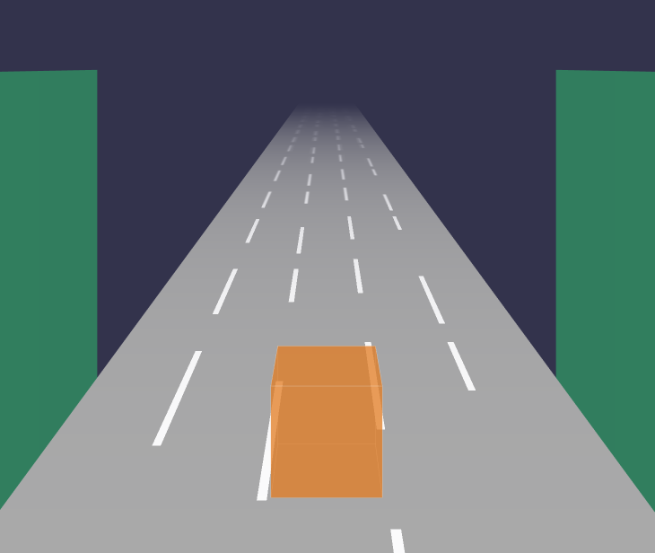
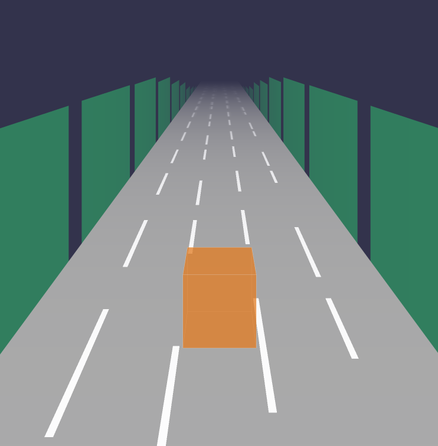
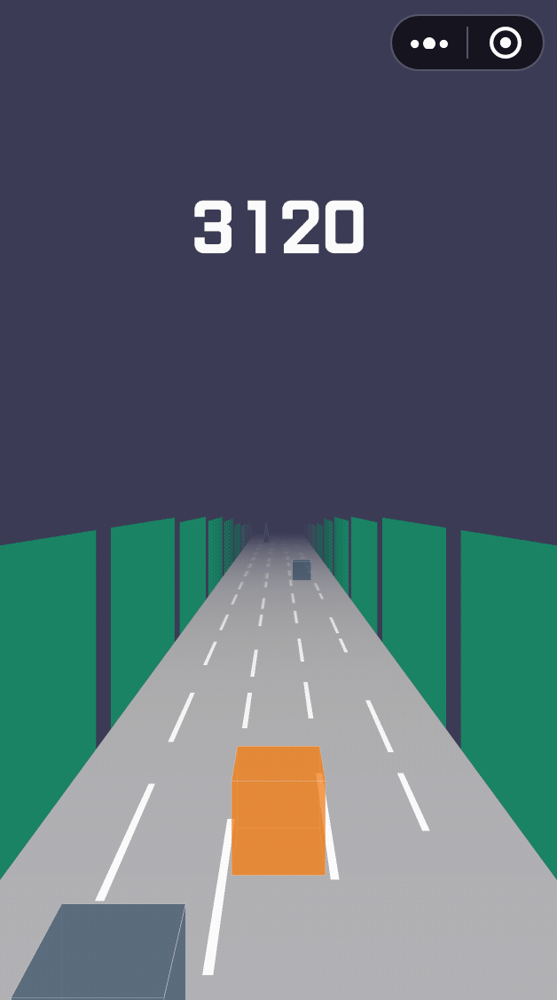
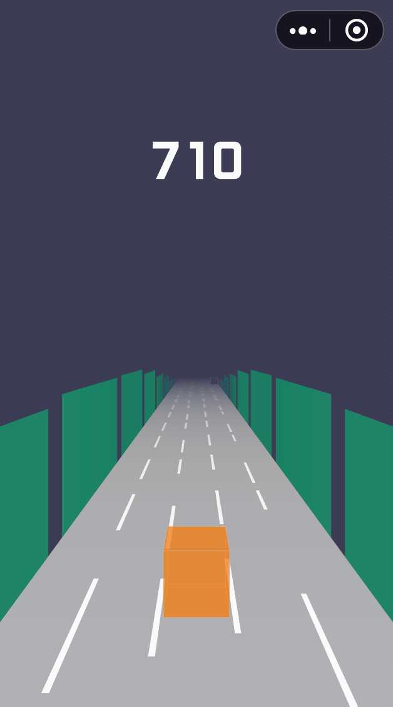

## 目录

* [背景音乐](#背景音乐)
* [音乐动画](#音乐动画)
* [总结](#总结)

这次我们要干一件很酷的事情：播放背景音乐并把背景音乐转换为动画，视觉与听觉同步，大大提高了游戏的体验。

## 背景音乐

播放音乐这块非常简单，微信小游戏已经提供了API：`createInnerAudioContext`，用它来创建音频上下文，并加载指定音乐资源：

```js
const audio = wx.createInnerAudioContext();
this.audio.src = 'audio/bgm.mp3';
// 进入可以播放状态
this.audio.onCanplay(() => {
  this.audio.play();
});
// 播放结束后，重新播放，不用loop的原因是，后面我们需要用这个回调做重置音乐动画帧动画。
this.audio.onEnded(() => {
  this.audio.play(); // 
});
```

## 音乐动画

完成了背景音乐的播放，接下来我们要实现把音乐的频率转换波形图，然后**实时**显示到游戏画面，但是到写这个教程为止，微信小游戏还未开放`WebAudio`的能力，为此我写了一个cli工具，可以离线解析音乐的频率，感兴趣可以看下这篇文章：https://github.com/inarol/blog/blob/master/Other/audio_analyser.md。

离线解析后，我们得到一个以播放跨度为`0.05`的json文件，波形数据长度为`12`的音乐频率json文件，key是播放时间，value是频率数据，格式如下：

```json
{
  "0.00":"255,251,226,224,213,194,189,170,121,39,0,0",
  "0.05":"255,255,226,196,199,190,169,138,95,26,0,0",
  ...
}
```

首先我们新建一个`MusicFrame`类，用于渲染音乐动画：

```js
export default class MusicFrame {
  // 预渲染
  render() {}
}
```

然后创建一对频率波形图：

```js
const meshGroup = new THREE.Group();
const geometry = new THREE.PlaneGeometry(width, height);
const material = new THREE.MeshBasicMaterial({
  color: 0x2fcc71,
  transparent: true,
  opacity: 0.5,
});
const mesh = new THREE.Mesh(geometry, material);
mesh.position.x = - RACETRACK.width / 2;
mesh.rotation.set(0, THREE.Math.degToRad(90), 0);
// 克隆
const meshImage = mesh.clone();
meshImage.position.x = RACETRACK.width / 2;
meshImage.rotation.set(0, THREE.Math.degToRad(-90), 0);
meshGroup.add(mesh);
meshGroup.add(meshImage);
```



然后读取第一帧的音乐频率，转换为数组后：`[255,251,226,224,213,194,189,170,121,39,0,0]`，然后依次渲染频率波形图：

```js
// max是波形图的峰值
const max = MUSIC_FRAME.max;
for (let i = 0; i < frequencyArray.length; i += 1) {
  const meshGroupClone = meshGroup.clone();
  // 最小为1，否则THREE.js渲染会有警告
  const frequencyValue = Number(frequencyArray[i]) || 1;
  const scaleValue = frequencyValue / max;
  meshGroupClone.scale.set(1, scaleValue, 1);
  // 默认波形图的中心点在坐标中心，这里是下移y坐标，并补充缩放的一半高度，最终达到以跑道地面为起始点的波形图。
  meshGroupClone.position.y = RACETRACK.y + (scaleValue * height / 2);
  // 宽度 + padding 排列依次波形图
  meshGroupClone.position.z = -(width + padding) * i;
  group.add(meshGroupClone);
}
```

依次处理这些音乐帧后，我们可以看到音乐波形图已经整齐的排列在跑道的两边了：




不过此时，音乐波形图还是静止的，要让音乐动起来，我们需要读取音乐的进度时间，此时可能会考虑用`audio.currentTime`去读取音频文件的播放时间，但是每一帧都去读取会消耗大量的内存（实测会导致微信闪退），因此需要在`MusicFrame`类自己维护一个当前的播放`time`，并且以`0.05`的数值递增，再更新波形的高度：

```js
const frequencyArray = frequency.split(',');
const frameLength = frequencyArray.length;
const height = MUSIC_FRAME.height;
const max = MUSIC_FRAME.max;
for (let i = 0; i < frameLength; i += 1) {
    const meshGroup = this.mesh.children[i];
    const frequencyValue = Number(frequencyArray[i]) || 1;
    const scaleValue = frequencyValue / max;
    meshGroup.scale.set(1, scaleValue, 1);
    meshGroup.position.y = RACETRACK.y + (scaleValue * height / 2);
}
```

此时已经完成音频频率波形图的振动效果了：




一切的元素都在运动，音乐动画帧没理由还是静止不前进吧，我们再让音乐帧运动起来，实现原理是，每前进 `width + padding`，即重置音乐帧的位置，然后循环，就会形成前进动画的效果：

```js
private moveFrame() {
  const width = MUSIC_FRAME.width;
  const padding = MUSIC_FRAME.padding;
  const eachFrameWidth = width + padding;
  this.mesh.position.z += this.game.speed * Math.abs(CAMERA.far) / this.game.fps;
  // 位移一个波形的距离后，重置位置，然后一直循环，作为音频波形前进的动画。
  if (this.mesh.position.z >= eachFrameWidth) {
    this.mesh.position.z = 0;
  }
}
```

至此，音乐动画基本已经完成：




另外还有一个小细节，音乐循环播放时，需要重置一下`time`：

```js
this.audio.onEnded(() => {
  ...
  this.musicFrame.time = 0;
});
```

## 总结

现在我们的游戏的场景已经饱满了很多，本文实现的技术主要难点的主要是如何解决微信小游戏环境不支持`webAudio`能力的问题，播放音乐或音乐动画的实现都很简单。最后我们把**音乐文件**、**音乐解析文件**的加载逻辑，抽离到`preload`模块。详细的项目结构如下：

```bash
./src
├── Game
│   ├── Gamepad // 游戏手柄
│   │   └── index.ts
│   ├── NPC // NPC角色
│   │   ├── box.ts // 正方形
│   │   ├── cone.ts // 锥形
│   │   └── index.ts
│   ├── Player // 游戏主角
│   │   └── index.ts
│   ├── Pool // 对象池
│   │   └── index.ts
│   ├── Racetrack // 跑道
│   │   └── index.ts
│   ├── Score // 分数
│   │   └── index.ts
│   ├── MusicFrame // 音乐动画帧
│   │   └── index.ts
│   ├── camera // 摄影机
│   │   └── index.ts
│   ├── constant.ts // 常量
│   ├── helper
│   │   ├── axes.ts  // 辅助坐标系
│   │   └── orbitControls.ts // 摄影机轨道控制器
│   ├── index.ts 
│   ├── renderer  // WebGL渲染器
│   │   └── index.ts
│   ├── scene // 场景
│   │   └── index.ts
│   └── util // 工具
│       └── index.ts
└── preload
│   ├── index.ts 资源加载
├── index.ts  // 入口
└── lib
    ├── weapp-adapter-extend // weapp-adapter的扩展，新增window的方法
    │   ├── index.js
    │   └── window.js
    └── weapp-adapter.js // 模拟BOM，DOM
```

代码：：https://github.com/inarol/rungame/tree/section5