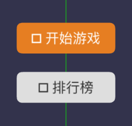
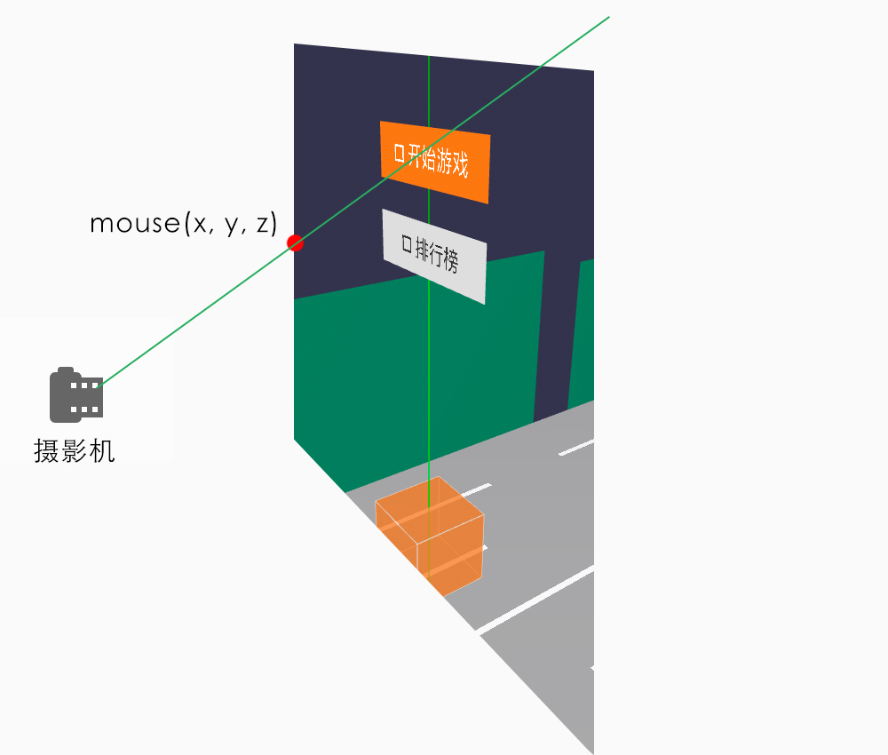
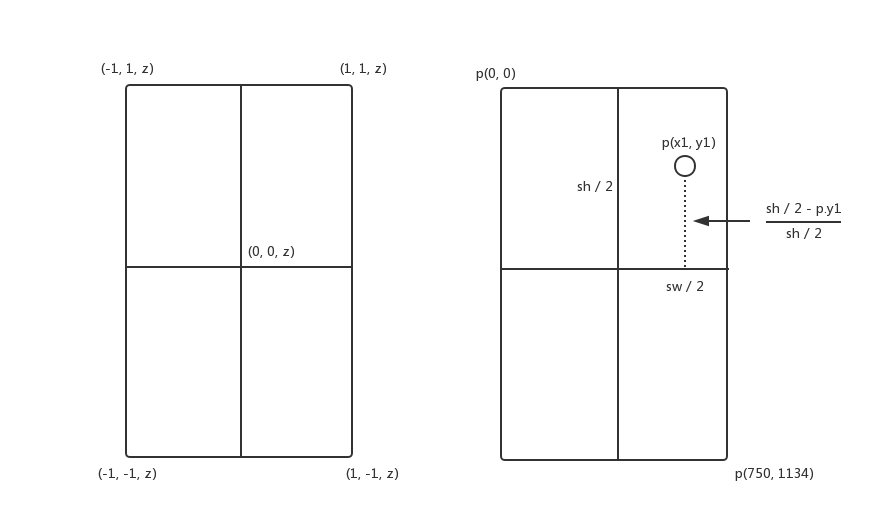

写到这里，我们已经大致完成了游戏过程的逻辑。现在，我们需要实现游戏的菜单以及按钮，然后再把开始游戏的流程串联起来。

## 菜单

首先我们新建一个菜单类`Menu`，实质上是实现一个放置按钮的容器`THREE.Group`，最后再统一添加到`topScene`（顶层舞台）：

```js
// Menu.ts
class Menu {
  constructor() {
    this.mesh = this.render();
  }
  private render() {
    const group = new THREE.Group();
    // 开始游戏按钮
    const startButton = new Button();
    // 排行榜按钮
    const rankButton = new Button();
    group.add(startButton.mesh);
    group.add(rankButton.mesh);
    return group;
  }
}

// Game.ts
...
/** 显示菜单 */
public showMenu() {
  this.menu = new Menu({
    game: this,
  });
  this.topScene.add(this.menu.mesh);
}

```

## 按钮

### 自定义按钮图形

Three.js没有封装按钮的类，需要我们自行实现。我们需要实现的是带有圆角的矩形按钮，所以`PlaneGeometry`显然已经不能满足需求了，但我们可以用`Shape`画出圆角矩形。首先我们新增一个Button类，宽高分别为`width`和`height`，圆角为`radius`，位置坐标为`x`，`y`，首先自定义一个圆角矩形：

```js
/** 自定义shape */
...
private getShape() {
  const x = - width / 2;
  const y = - height / 2;
  const roundedRectShape = new THREE.Shape();
  roundedRectShape.moveTo(x, y + radius);
  roundedRectShape.lineTo(x, y + height - radius);
  roundedRectShape.quadraticCurveTo(x, y + height, x + radius, y + height);
  roundedRectShape.lineTo(x + width - radius, y + height);
  roundedRectShape.quadraticCurveTo(x + width, y + height, x + width, y + height - radius);
  roundedRectShape.lineTo(x + width, y + radius);
  roundedRectShape.quadraticCurveTo(x + width, y, x + width - radius, y);
  roundedRectShape.lineTo(x + radius, y);
  roundedRectShape.quadraticCurveTo(x, y, x, y + radius);
  return roundedRectShape;
}
```

然后用画出来的图形，生成ShapeGeometry，**注意自定义Shape是没有uv坐标的，需要我们自己手动添加，否则贴图将不能正常显示**，`assignUVs`该模块抽取出来在`threejs-shim`实现：

```js
class Button {
  constructor() {
    this.mesh = this.render();
  }
  ...
  private render() {
    const material = new THREE.MeshBasicMaterial();
    const shapeGeometry = new THREE.ShapeGeometry(shape);
    // 为自定义图形添加uv坐标
    shapeGeometry.assignUVs();
    const mesh = new THREE.Mesh(shapeGeometry, material);
    return mesh;
  }
  ...
}
```

### 按钮贴图

此时的按钮还是只是一个图形而已，我们还需要给按钮加上文本或图标，这里可以用设计好的图片，也可以用canvas自己画一个（出于维护的方便，我选择用一个开源库[cax](https://github.com/dntzhang/cax)画按钮），然后转化成纹理贴图，最后贴到按钮网格上就OK了。但需要注意的是，我们的canvas需要自己适配高清屏，适配参考网上资料即可，这里不再做赘述。

还有注意开发者调试工具暂不支持加载字体，所以iconfont会显示乱码，需要做好环境兼容，另外图标的unicode码需要加上`\u`：



### 按钮事件

我们再给按钮新建一个TAP事件，虽然Three.js没有帮我为平面网格提供绑定事件，但是内置的`Raycaster`类却为按钮事件提供更为简便的实现方式，Raycaster是光射线的意思，如果起点是Camera，然后再确定一个点mouse(x, y, z)，就可以画出一条射线了，那么射线穿过的地方，就可以被拾取到了。



mouse(x, y, z)是遵循webGL坐标系，取值范围为-1，1，那么如果我点击屏幕的二维坐标是`p(x1, y1)`，屏幕宽度分别为`sw`与`sh`，要如何确定mouse这个点，且看下图：



`sh / 2 - p.y1`为虚线的高度，再除于`sw / 2`就是标准后的WebGL坐标系的y坐标，同理x坐标 = (sh / 2 - p.x1) / (sh / 2)。最后我们给按钮注册一个订阅`Tap`事件，获取到点击坐标后，再标准化该坐标，然后用Raycaster射线检测该点击是否穿过指定的网格，就可以如果穿过，我们再执行回调函数`callback`:

```js
/** 给按钮添加Tap事件 */
...
private addTapEvent() {
  if (this.callback) {
    this.tapEvent = this.game.emitter.addListener(EVENTS.TAP, ({ position }) => {
      const raycaster = new THREE.Raycaster();
      const x = 1 - (position.x / (SCREEN_WIDTH / 2));
      const y = 1 - (position.y / (SCREEN_HEIGHT / 2));
      const mouse = new THREE.Vector2(x, y);
      raycaster.setFromCamera(mouse, this.game.camera);
      const intersect = raycaster.intersectObject(this.mesh);
      if (intersect.length) {
        this.callback();
      }
    });
  }
}
```

### 开始游戏

给**开始游戏**按钮注册了`Tap`事件后，我们就可以控制游戏的开始了，首先给`Game`类新增一个start的方法：

```js
...
public start() {
  this.isPlaying = true;
  this.playAudio();
}
```

然后在`Menu`类渲染按钮时，注册callback函数，并函数内执行该start方法。

## 总结

除了渲染游戏按钮和注册按钮事件外，还做了：

- `preload`模块加载字体文件。
- 新增开场音乐，玩家点击开始游戏后，再切换到游戏音乐。

详细的项目结构如下：

```bash
./src
├── Game
│   ├── Button // 游戏按钮
│   │   └── index.ts
│   ├── Menu // 游戏菜单
│   │   └── index.ts
│   ├── Gamepad // 游戏手柄
│   │   └── index.ts
│   ├── NPC // NPC角色
│   │   ├── box.ts // 正方形
│   │   ├── cone.ts // 锥形
│   │   └── index.ts
│   ├── Player // 游戏主角
│   │   └── index.ts
│   ├── Pool // 对象池
│   │   └── index.ts
│   ├── Racetrack // 跑道
│   │   └── index.ts
│   ├── Score // 分数
│   │   └── index.ts
│   ├── MusicFrame // 音乐动画帧
│   │   └── index.ts
│   ├── camera // 摄影机
│   │   └── index.ts
│   ├── constant.ts // 常量
│   ├── helper
│   │   ├── axes.ts  // 辅助坐标系
│   │   └── orbitControls.ts // 摄影机轨道控制器
│   ├── index.ts 
│   ├── renderer  // WebGL渲染器
│   │   └── index.ts
│   ├── scene // 场景
│   │   └── index.ts
│   └── util // 工具
│       └── index.ts
└── preload
│   ├── index.ts 资源加载
├── index.ts  // 入口
└── lib
    ├── weapp-adapter-extend // weapp-adapter的扩展，新增window的方法
    │   ├── index.js
    │   └── window.js
    └── weapp-adapter.js // 模拟BOM，DOM
    └── threejs-shim.js // treejs的垫片
```

代码：：https://github.com/inarol/rungame/tree/section6

